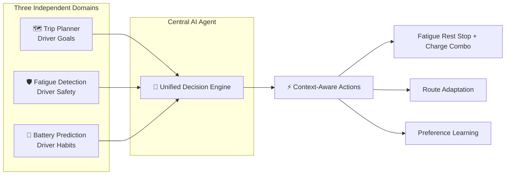
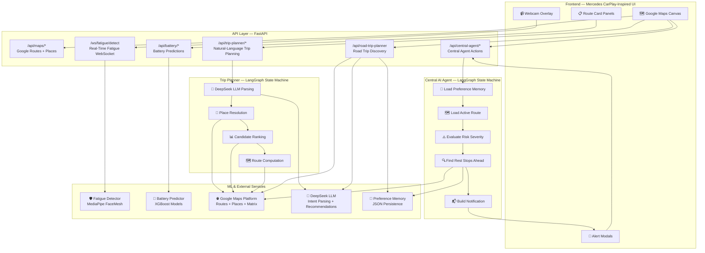
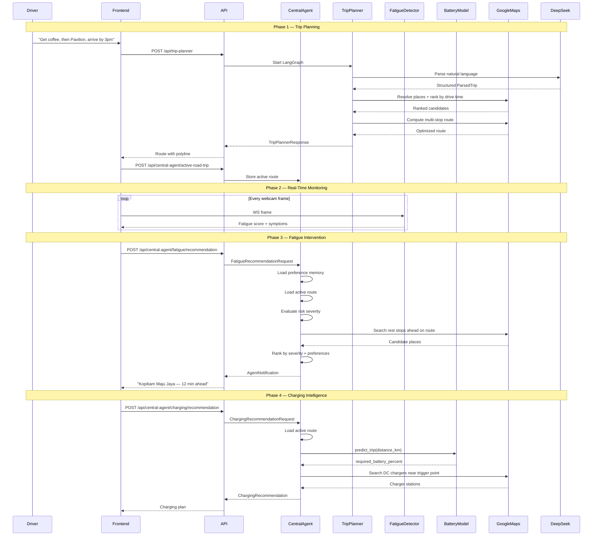

# MEME (Mercedes Enhanced Mobility Engine)

> **A centralized AI agent that orchestrates trip planning, fatigue detection, and battery prediction to deliver a safe, personalized, and intelligent EV driving experience.**

---

## 📋 Table of Contents

- [Problem Statement](#-problem-statement)
- [Solution: Why a Central AI Agent?](#-solution-why-a-central-ai-agent)
- [AI vs No-AI Comparison](#-ai-vs-no-ai-comparison)
- [Technical Architecture](#-technical-architecture)
- [Features Deep Dive](#-features-deep-dive)
- [Tech Stack](#-tech-stack)
- [Project Structure](#-project-structure)
- [Getting Started](#-getting-started)
- [API Reference](#-api-reference)
- [Data Flow](#-data-flow)

---

## 🎯 Problem Statement

Modern cars are full of sensors and smart features, but they share three core flaws. A **Centralized AI Agent** fixes all of them.

---

### 🔴 Problem 1: Ineffective Use of Driver Data

Connected cars constantly record how you drive — your speed, braking, battery use, routes, and departure times. This data shows clear patterns: you might drive 40% more on Saturdays, or your Friday commute drains the battery faster than your Tuesday one.

Right now, that data gets sent to the manufacturer's servers for fleet-wide analysis. The driver who created it gets almost nothing useful in return. **The car collects personal driving data, but no personal insights ever come back.**

> 💡 **The agent learns on-device.** Driving patterns train local models that stay in the car. Battery predictions adapt to your weekly habits. Preferences are stored in a simple local file. Cloud help is optional. **Your data works for you, not someone else.**

---

### 🔴 Problem 2: Isolated Intelligent Systems

Today's cars have many smart systems — cruise control, lane assist, drowsiness detection, range estimation, voice navigation. Each one works fine on its own. But none of them share information.

The drowsiness system knows you're tired but can't ask navigation to find a rest stop. The range estimator knows your battery is low but can't check if that rest stop has a charger. **Lots of smart pieces, but no central brain to tie them together.**

> 💡 **The agent connects everything.** All systems share one view of your route. Fatigue triggers a search for rest stops ahead on your path. Those stops get checked for chargers too. One problem, one stop. **Features become a team instead of strangers.**

---

### 🔴 Problem 3: Lack of personalization

Car systems treat every driver the same. The range estimator uses one formula — whether you're a careful Sunday driver or a fast Friday commuter. Navigation suggests the same route whether you love highways or avoid them. Rest-stop recommendations don't care that you always pick cafes over petrol stations. And nothing ever changes — your 100th trip is no smarter than your first. **The car never learns who you are.**

> 💡 **The agent builds a profile over time.** Every choice you make — accepting a stop, dismissing one, picking a route — updates a local preference file. Places you like get recommended more often. Places you dislike fade away. **Every trip makes the system a little smarter about you.**

---

> **In short**: Data leaves and never returns. Features work alone. The car never learns. A centralized AI agent keeps data local, connects every system, and gets better with every drive.

---

## 💡 Solution: Why a Central AI Agent?

Our **Central AI Agent** is a unified intelligence layer that connects all three features, making real-time decisions that consider the *whole* journey:



### How the Agent Works

| Capability | Description |
|---|---|
| **Context Fusion** | Combines live fatigue scores, active route geometry, battery state-of-charge, and user preference history into a single decision context |
| **Spatial Reasoning** | Searches ahead along the remaining route (not just nearby) for rest stops and chargers, ranking by actual drive time, not straight-line distance |
| **Severity-Driven Prioritization** | Higher fatigue risk → prioritizes closer stops; lower risk → prioritizes higher-rated stops further ahead |
| **Preference Learning** | Remembers which stop types you love (kopitiams, malls) and which you dismiss (petrol stations), personalizing every future recommendation |
| **Opportunity Bundling** | Identifies when a fatigue rest stop overlaps with a charging need, reducing total stops and journey time |
| **Human-in-the-Loop** | Never acts autonomously — presents actionable notifications with one-tap acceptance, keeping the driver in control |

### Why a Centralized Agent

| Principle | Benefit |
|---|---|
| **Single Decision Point** | All inputs — fatigue scores, battery levels, route geometry, user preferences — converge into one reasoning step. The agent weighs every factor simultaneously and produces one recommendation. No conflicting outputs from competing services. |
| **Atomic State** | The agent owns the entire journey state. When fatigue triggers a rest-stop search, the result is immediately available to the charging module in the same execution context. No eventual consistency, no stale caches, no missed bundles. |
| **Lower Latency** | One agent invocation replaces a chain of microservice calls. Route data is loaded once, not fetched independently by fatigue, charging, and preferences services. Fewer network hops, faster response to the driver. |
| **Simpler Reasoning** | A single state machine is easier to debug, test, and reason about than a distributed web of services that must be orchestrated externally. |
| **Extensibility** | New capabilities — weather alerts, traffic re-routing, maintenance reminders — register into the same agent graph without refactoring existing modules. The agent grows without adding architectural complexity. |

---

## ⚖️ AI vs No-AI Comparison

| Scenario | ❌ **Without Central AI Agent** | ✅ **With Central AI Agent** |
|---|---|---|
| **Fatigue alert while driving** | Car beeps. Driver manually opens Google Maps, searches "rest area near me," checks if it's on the route, checks rating, checks if it has a charger — all while drowsy and driving. Takes 60+ seconds of distracted driving. | Agent detects fatigue (score ≥ 50), loads your active route, searches for rest stops *ahead on your route*, ranks by your preferences, and shows: *"Kopitiam Maju Jaya — 12 min ahead on your route, ⭐ 4.4. Rest there?"* One tap. Under 2 seconds. |
| **Multi-stop trip with time constraint** | Driver manually searches each place, copy-pastes addresses, guesses arrival times, re-orders stops by trial and error. Often gives up and just drives directly. | Driver types: *"Get coffee at a good cafe, then go to Pavilion, arrive by 3pm."* Agent parses intent, resolves places, ranks by drive time, validates time constraint, returns optimized route. |
| **Low battery on a long trip** | Driver sees "50km remaining" and panics, frantically searching for chargers, unsure if they'll make it. May stop too early or too late, adding unnecessary charging stops. | Agent loads active route, predicts battery usage via ML model trained on your driving patterns, computes exactly where you'll hit 20% reserve, searches for DC fast chargers at that point, and recommends: *"Charge at Shell Recharge, Bandar Utama — you'll arrive with 22%."* |
| **Learning user preferences** | Every trip starts from scratch. The system never remembers that you hate petrol station stops and love kopitiams. | Agent builds a preference memory from every accept/dismiss action. After 5 trips, rest stop recommendations are personalized to your taste. |
| **Bundling rest + charge** | Driver stops for rest, then 30 minutes later realizes battery is low and stops again for charging. Two stops, double the delay. | Agent sees fatigue score rising AND battery trending low, recommends a single stop that satisfies both needs: *"Rest at Starbucks Bangsar — also has a DC charger. Arrive with 28%."* |

### Quantitative Impact

| Metric | Without AI | With AI | Improvement |
|---|---|---|---|
| **Distracted driving time during fatigue** | ~60s (manual search) | ~2s (one tap) | **97% reduction** |
| **Trip planning time (3-waypoint)** | ~5 min (manual) | ~15s (natural language) | **95% reduction** |
| **Range anxiety incidents** | Frequent (binary range indicator) | Rare (predictive ML + charger routing) | **Subjective but significant** |
| **Unnecessary stops** | High (rest + charge separate) | Low (agent bundles opportunities) | **Up to 50% fewer stops** |
| **Preference personalization** | None (amnesiac system) | Builds over time (memory-based) | **Gets better with every trip** |

---

## 🏗️ Technical Architecture



### Component Interaction Diagram



---

## 🔬 Features Deep Dive

### 🛡️ Fatigue Detection — Driver Safety

Real-time drowsiness monitoring via webcam, powered by **MediaPipe FaceMesh**.

| Symptom | Detection Method | Contribution to Score |
|---|---|---|
| 😴 Eyes Closed | Eye Aspect Ratio (EAR) < 0.22 for >1.2s | +35 points |
| 👁️ Excessive Blinking | >18 blinks per 60 seconds | +8 per count (max 24) |
| 🥱 Yawning | Mouth Open Ratio > 0.55 for >1s | +28 points (per yawn: +10, max 30) |
| 😵 Head Nodding | Nose Y-position drop-rebound pattern | +25 points (per nod: +15, max 45) |

**Severity thresholds**: Normal (0–24) → Mild (25–49) → Warning (50–74) → **High Risk (75–100)**

**Alert triggers**: Score ≥ 85 OR ≥ 3 head nods → full-screen alert modal

### 🔋 Battery Prediction — Driver Habits

Three **XGBoost models** trained on real EV driving data (500+ trips):

| Model | Input | Output | Use Case |
|---|---|---|---|
| **Trip Model** | `distance_km` | `required_battery_percent` | "How much battery do I need for this trip?" |
| **Distance Model** | `day_of_week` | `expected_distance_km` | "How far do I typically drive on Wednesdays?" |
| **Usage Model** | `day_of_week` | `battery_used_percent` | "How much battery do I typically use on Saturdays?" |

**Charging decisions** made by the agent:
- Battery < 20% → **Charge before departure**
- Remaining after trip ≥ 20% → **No charging required**
- Remaining ≥ 0 but < 20% → **Charge near destination**
- Remaining < 0 → **Charge during trip** (find DC fast charger at trigger point)

### 🗺️ Trip Planner — Driver Goals

Multi-step LangGraph pipeline that converts natural language into optimized routes:

```
"I want coffee at a nice cafe, then go to Pavilion, be there by 3pm"
    ↓ DeepSeek LLM Parsing
ParsedTrip { origin: "current", waypoints: [...], preferences: [...], arriveBy: "15:00" }
    ↓ Google Places Resolution
Candidate ranking by drive time + rating + text match
    ↓ Google Routes Computation
Optimized multi-stop route with time validation
    ↓ Preference Persistence
Route preferences saved to memory for future trips
```

**Supports**: Specific places, category queries ("a good kopitiam"), nearby references ("near KLCC"), food choices, time constraints (arrive by / depart after), and human-in-the-loop clarification when the intent is ambiguous.

### 🚗 Road Trip Discovery

AI-powered exploration that finds interesting stops along your route and at your destination, with DeepSeek-generated explanations of why each place is worth visiting.

### 🧠 Preference Memory

A self-learning system stored in `data/user_memory.json`:

```json
{
  "preferredStopTypes": { "kopitiam": 5, "cafe": 3 },
  "dislikedStopTypes": { "petrol_station": 2 },
  "lovedPlaces": [{ "placeId": "...", "name": "Kopitiam Maju Jaya" }],
  "dismissedPlaces": []
}
```

Every accept/dismiss action updates the memory, which then influences:
- Rest stop ranking (preferred types get -35s boost per count)
- Road trip recommendation ordering
- Charger stop preference weighting

---

## 🛠️ Tech Stack

| Layer | Technology | Purpose |
|---|---|---|
| **Backend Framework** | FastAPI (Python 3.12) | REST API + WebSocket server |
| **AI Orchestration** | LangGraph | State-machine agent framework with checkpointing |
| **LLM** | DeepSeek (via ChatOpenAI) | Natural-language trip parsing + road trip recommendations |
| **ML** | XGBoost + joblib | Battery usage prediction (3 models) |
| **Computer Vision** | MediaPipe FaceMesh | Real-time facial landmark detection for fatigue |
| **Maps** | Google Maps Platform (Routes, Places, Matrix) | Routing, place search, distance matrices |
| **Frontend** | Vanilla JS + Google Maps JS API | Mercedes CarPlay-inspired SPA |
| **Styling** | Tailwind CSS (CDN) | Utility-first responsive design |
| **Persistence** | SQLite (LangGraph checkpoints) + JSON (preferences) | Graph state + user memory |
| **Server** | Uvicorn | ASGI server with hot reload |

---

## 📁 Project Structure

```
mercedes/
├── run.ps1                          # One-command launcher (venv + uvicorn)
├── backend/
│   ├── requirements.txt             # Production dependencies
│   ├── requirements-dev.txt         # Dev dependencies
│   └── app/
│       ├── main.py                  # FastAPI app with lifespan + router mounting
│       ├── core/
│       │   └── config.py            # Pydantic Settings (.env loader)
│       ├── central_agent/           # 🧠 Central AI Agent
│       │   ├── graph.py             # LangGraph state machine (fatigue → rest stops)
│       │   ├── state.py             # Active road trip storage (thread-safe)
│       │   ├── schemas.py           # Notification, Fatigue, Charging models
│       │   ├── registry.py          # Module registry (extensible)
│       │   ├── rest_stop_service.py # Find + rank rest stops ahead on route
│       │   └── charging_service.py  # Charging decision + charger search
│       ├── trip_planner/            # 🗺️ Multi-Step Trip Planner
│       │   ├── graph.py             # LangGraph state machine (parse → resolve → rank → route)
│       │   ├── parser.py            # DeepSeek LLM intent parser
│       │   ├── models.py            # ParsedTrip, WaypointIntent, Candidate
│       │   ├── routing.py           # Google Routes multi-stop computation
│       │   ├── resolution.py        # Place resolution + candidate ranking
│       │   ├── service.py           # Plan + resume trip (human-in-the-loop)
│       │   ├── road_trip_service.py # Road trip discovery with AI recommendations
│       │   └── schemas.py           # Request/Response models
│       ├── fatigue/                 # 🛡️ Fatigue Detection
│       │   ├── detector.py          # MediaPipe FaceMesh real-time detector
│       │   ├── config.py            # Thresholds (EAR, blink, yawn, nod)
│       │   └── utils.py             # EAR calculation + geometry helpers
│       ├── battery/                 # 🔋 Battery Prediction
│       │   └── model_service.py     # XGBoost models (trip, distance, usage)
│       ├── services/                # 🔧 Shared Services
│       │   ├── google_routes.py     # Google Routes API wrapper
│       │   ├── google_places.py     # Google Places API wrapper
│       │   ├── location_context.py  # Home/work tag resolution
│       │   ├── memory_service.py    # Preference memory CRUD
│       │   ├── place_categories.py  # Search category definitions
│       │   └── trip_planner_service.py / road_trip_planner_service.py
│       ├── routers/                 # 🌐 API Endpoints
│       │   ├── central_agent.py     # /api/central-agent/*
│       │   ├── trip_planner.py      # /api/trip-planner/*
│       │   ├── battery.py           # /api/battery/*
│       │   ├── fatigue.py           # /ws/fatigue/detect
│       │   └── maps.py              # /api/maps/*
│       └── schemas/                 # Shared Pydantic models
│           ├── preferences.py       # TripPreferences
│           ├── routes.py            # RouteResponse, GeoLocation
│           └── trip_planner.py      # Shared trip planner types
├── frontend/                        # 🖥️ Mercedes CarPlay-Inspired UI
│   ├── index.html                   # SPA shell (side rail + map + panels)
│   ├── app.js                       # Compatibility entrypoint
│   ├── style.css                    # Global styles
│   ├── css/
│   │   ├── base-layout.css          # Layout foundations
│   │   ├── battery.css              # Battery panel styles
│   │   ├── fatigue.css              # Fatigue overlay styles
│   │   ├── map-overlays.css         # Map annotations
│   │   ├── responsive.css           # Responsive breakpoints
│   │   ├── road-trip.css            # Road trip recommendation cards
│   │   └── trip-choice.css          # Trip choice modal styles
│   └── js/
│       ├── api.js                   # API client (fetch wrappers)
│       ├── app-state.js             # Central state + DOM element references
│       ├── bootstrap.js             # Event listener wiring
│       ├── core-map.js              # Google Maps initialization + drawing
│       ├── navigation.js            # Sidebar + mode switching
│       └── features/
│           ├── battery.js           # Battery panel logic
│           ├── fatigue.js           # WebSocket + webcam + alert modal
│           ├── road-trip.js         # Road trip discovery panel
│           ├── settings-tags.js     # Home/work tags + settings
│           ├── trip-actions.js      # Trip planner + route actions
│           └── trip-choice-modal.js # Choice/clarification modal
├── data/
│   ├── user_memory.json             # Preference memory (loved/dismissed types/places)
│   └── battery/models/
│       └── ev_battery_models.joblib # Serialized XGBoost models
└── tests/
    ├── test_battery_router.py
    ├── test_central_agent.py
    ├── test_charging_recommendation.py
    ├── test_fatigue_router.py
    ├── test_google_routes.py
    ├── test_location_context.py
    ├── test_preference_memory.py
    ├── test_road_trip_planner.py
    ├── test_settings_router.py
    ├── test_trip_planner_graph.py
    └── test_central_agent_preferences_router.py
```

---

## 🚀 Getting Started

### Prerequisites

- **Python 3.12+**
- **Google Maps Platform API key** (with Routes, Places, and Matrix APIs enabled)
- **DeepSeek API key** (for LLM-powered trip parsing and road trip recommendations)
- **Webcam** (for fatigue detection)

### Environment Setup

Create a `.env` file in the project root:

```env
GOOGLE_MAPS_BROWSER_KEY=your_google_maps_browser_api_key
GOOGLE_MAPS_SERVER_KEY=your_google_maps_server_api_key
DEEPSEEK_API_KEY=your_deepseek_api_key
DEEPSEEK_MODEL=deepseek-chat
DEEPSEEK_BASE_URL=https://api.deepseek.com/v1
```

### Installation & Running

```powershell
# Option 1: One-command launch (Windows)
.\run.ps1

# Option 2: Manual setup
python -m venv venv
.\venv\Scripts\Activate.ps1
pip install -r backend/requirements.txt
uvicorn backend.app.main:app --host 127.0.0.1 --port 8080 --reload
```

The app will be available at:
- **App**: [http://127.0.0.1:8080](http://127.0.0.1:8080)
- **Swagger Docs**: [http://127.0.0.1:8080/docs](http://127.0.0.1:8080/docs)

---

## 📡 API Reference

### Central Agent — `/api/central-agent`

| Method | Endpoint | Description |
|---|---|---|
| `POST` | `/active-road-trip` | Register a planned route for agent monitoring |
| `POST` | `/fatigue/recommendation` | Get rest stop recommendation from fatigue snapshot |
| `POST` | `/rest-stop/accept` | Accept a rest stop → route recomputed with stop |
| `POST` | `/charging/recommendation` | Get charging plan for active route |
| `POST` | `/charging/accept` | Accept a charging stop → route recomputed |
| `GET` | `/preferences` | Get preference memory summary |
| `POST` | `/preferences/feedback` | Record love/dismiss feedback on a stop type |
| `DELETE` | `/preferences` | Reset all preference memory |

### Trip Planner — `/api`

| Method | Endpoint | Description |
|---|---|---|
| `POST` | `/trip-planner` | Plan a trip from natural-language instruction |
| `POST` | `/trip-planner/resume` | Resume after clarification/choice interrupt |
| `POST` | `/road-trip-planner` | Discover interesting stops along route + at destination |

### Battery — `/api/battery`

| Method | Endpoint | Description |
|---|---|---|
| `GET` | `/health` | Battery model health status |
| `GET` | `/model/summary` | Model metrics + weekday driving statistics |
| `POST` | `/predict/trip` | Predict battery % needed for a trip distance |
| `POST` | `/predict/daily` | Predict daily distance + battery usage by day of week |

### Fatigue Detection — WebSocket

| Protocol | Endpoint | Description |
|---|---|---|
| `WS` | `/ws/fatigue/detect` | Stream webcam frames → receive fatigue score + symptoms |

### Maps — `/api`

| Method | Endpoint | Description |
|---|---|---|
| `GET` | `/maps/config` | Get Google Maps browser API key |
| `POST` | `/routes` | Compute simple origin→destination route |
| `GET` | `/location-tags` | Get saved home/work addresses |
| `POST` | `/location-tags` | Save home/work address |
| `GET` | `/settings` | Get all user settings |
| `POST` | `/settings/current-location` | Update current location |
| `POST` | `/settings/ev-battery-level` | Update EV battery percentage |

---

## 🔄 Data Flow

```
User Input (Natural Language)
    │
    ▼
Trip Planner (LangGraph + DeepSeek)
    │
    ├── Parses intent: origin, waypoints, time constraints, preferences
    ├── Resolves places via Google Places API
    ├── Ranks candidates by drive time via Google Routes Matrix
    ├── Computes optimized multi-stop route via Google Routes
    └── Persists route preferences to memory
    │
    ▼
Route Response (polyline + waypoints + timing)
    │
    ├── Displayed on Google Maps in frontend
    └── Registered with Central Agent as "active road trip"
    │
    ▼
┌──────────────── Real-Time Monitoring Loop ────────────────┐
│                                                           │
│  Webcam → Fatigue Detector → Fatigue Score (every frame)  │
│  User Input → Battery Model → Battery Predictions         │
│                                                           │
│  When Fatigue Score ≥ 50:                                 │
│    Central Agent loads active route                       │
│    Central Agent searches rest stops ahead on route       │
│    Central Agent ranks by severity + preferences          │
│    Frontend shows AgentNotification modal                 │
│    User accepts → Route recomputed with rest stop         │
│                                                           │
│  When Battery Check Requested:                            │
│    Central Agent loads active route                       │
│    Battery model predicts required % for trip distance    │
│    Agent decides: no charge / pre-departure / mid-trip    │
│    Google Places searches DC chargers at trigger point    │
│    Frontend shows ChargingRecommendation                  │
│    User accepts → Route recomputed with charging stop     │
│                                                           │
│  Preference Memory Updates:                               │
│    Every accept/dismiss → stored in user_memory.json      │
│    Influences all future rest stop + road trip rankings   │
└───────────────────────────────────────────────────────────┘
```

---

## 🧪 Testing

```powershell
# Run all tests
pytest backend/tests/ -v

# Run specific test suites
pytest backend/tests/test_trip_planner_graph.py -v
pytest backend/tests/test_central_agent.py -v
pytest backend/tests/test_battery_router.py -v
pytest backend/tests/test_fatigue_router.py -v
```

---

## 🏛️ Design Principles

| Principle | Implementation |
|---|---|
| **State Machine Architecture** | LangGraph for all complex workflows — enables checkpointing, interrupt/resume, and parallel fan-out |
| **Human-in-the-Loop** | Never takes autonomous actions; all interventions require explicit user acceptance |
| **Preference Learning** | Every interaction teaches the system; memory compounds over time |
| **Spatial Awareness** | All searches are route-relative (not just proximity-based), using polyline decoding + haversine |
| **Cross-Cutting Concerns** | Shared state across fatigue, charging, and trip planning eliminates redundant computation |
| **Graceful Degradation** | InMemorySaver fallback when SQLite unavailable; DeepSeek retries on parse failure |

---

## 📝 License

This project is a prototype/demonstration of an intelligent EV driving assistant concept.

