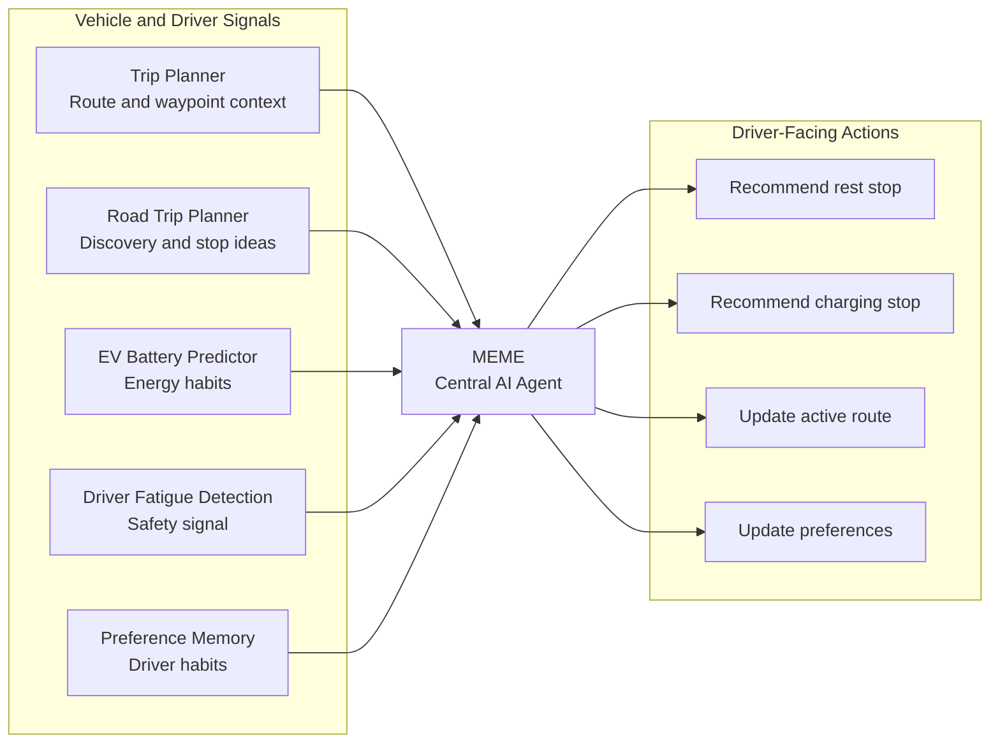
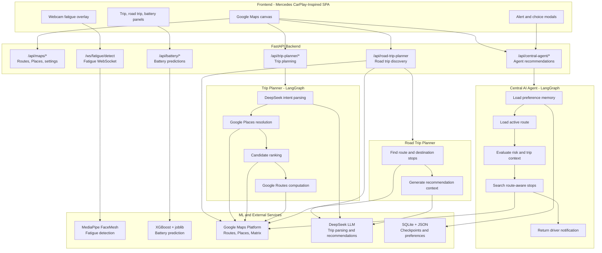
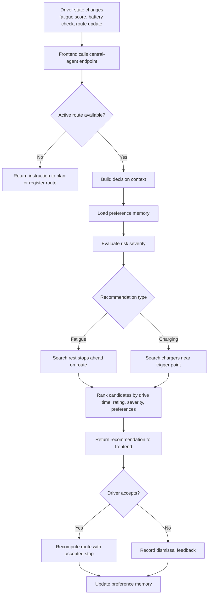
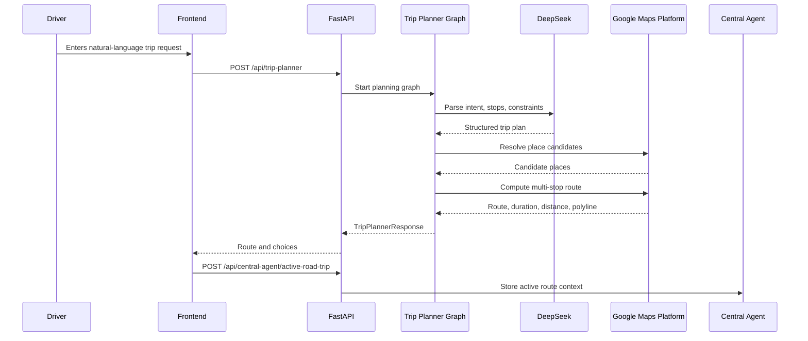
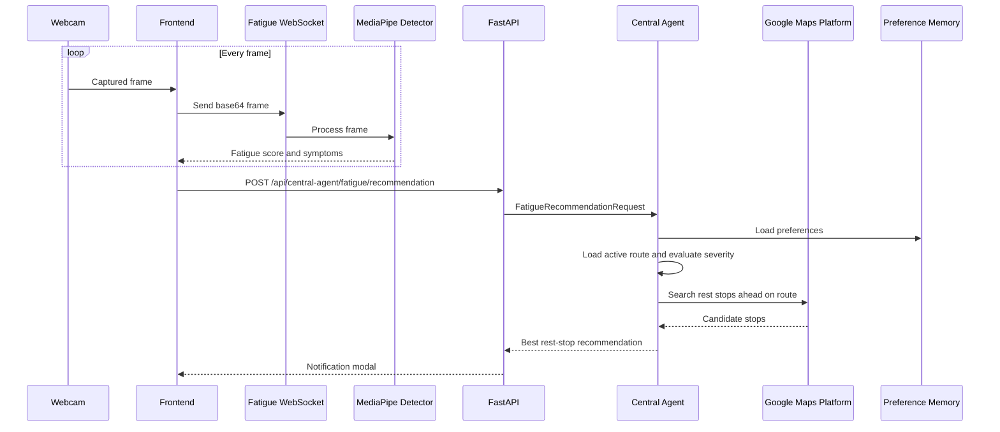
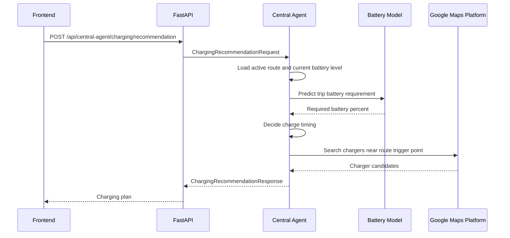
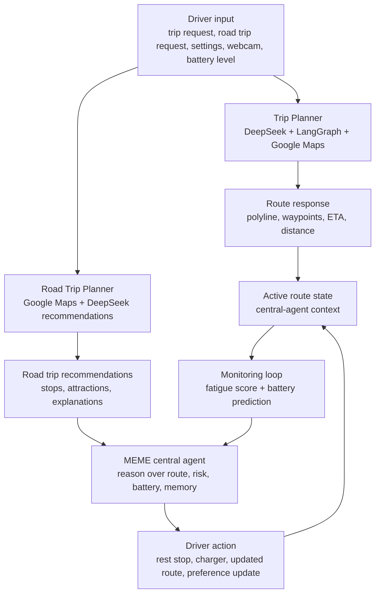

<p align="center">
  
</p>

<h1 align="center">MEME - Mercedes Enhanced Mobility Engine</h1>

<h2 align="center">Mercedes Vibathon 2026 Finalist Project</h2>

MEME is a centralized AI driving assistant that connects route planning, EV battery prediction, driver fatigue detection, and preference memory into one coordinated mobility engine. Instead of treating each vehicle feature as a separate tool, MEME acts as a unified decision layer that understands the full trip context and recommends the next safest, most useful action for the driver.

Built by **TehOLimauAis**.

## Live Links

| Resource | Link |
| --- | --- |
| Project presentation | [https://mercedes-slides.vercel.app/](https://mercedes-slides.vercel.app/) |
| Documentation website | [https://mercedes-docs.vercel.app/](https://mercedes-docs.vercel.app/) |

## Table of Contents

- [Overview](#overview)
- [Product Screenshots](#product-screenshots)
- [Problem](#problem)
- [Solution](#solution)
- [Core Features](#core-features)
- [Technical Architecture](#technical-architecture)
- [AI vs No-AI](#ai-vs-no-ai)
- [Tech Stack](#tech-stack)
- [Project Structure](#project-structure)
- [Getting Started](#getting-started)
- [API Reference](#api-reference)
- [Testing](#testing)
- [Roadmap](#roadmap)

## Overview

Modern vehicles already contain many intelligent systems: navigation, range estimation, fatigue alerts, driver profiles, and connected services. The problem is that these systems often operate independently. MEME connects them.

The project demonstrates a Mercedes CarPlay-inspired web experience backed by a FastAPI service, LangGraph AI workflows, Google Maps Platform routing, DeepSeek-powered trip understanding, XGBoost battery prediction, MediaPipe fatigue detection, and persistent driver preference memory.

The result is an assistant that can:

- Plan point-to-point or multi-stop trips from natural language instructions.
- Discover recommended stops and attractions for road trips.
- Predict EV battery needs based on trip distance and historical driving patterns.
- Detect fatigue from webcam frames in real time.
- Recommend rest stops or charging stops using the active route context.
- Learn from accepted and dismissed recommendations.
- Combine route, safety, battery, and preference signals into one recommendation.

## Product Screenshots

The following screenshots show the main MEME product experience across planning, battery intelligence, fatigue detection, and driver-facing recommendations.

### Road Trip Planner


### EV Battery Predictor


### Driver Fatigue Detection


### Demo Video

[](https://github.com/ethanlxz/mercedes-hackathon-2026/raw/new_vers/mercedes-slides/mercedes-hackathon-pitch-assets/mercedes-demo.mp4)

[Open the demo video](https://github.com/ethanlxz/mercedes-hackathon-2026/raw/new_vers/mercedes-slides/mercedes-hackathon-pitch-assets/mercedes-demo.mp4)

### Team


## Problem

Connected vehicles already collect rich driving data and include many advanced features, but the driver experience is still fragmented. Navigation, fatigue alerts, battery prediction, and personalization often work as separate systems instead of sharing context and acting together.

### 1. Lack of Personalization

Vehicle systems often fail to learn driver habits. Route suggestions, charging guidance, and rest-stop recommendations can feel generic even after repeated trips because the car does not build a meaningful preference memory around the driver.

### 2. Data Is Collected but Not Used Wisely

Cars collect route history, driving style, battery behavior, and usage patterns, but that data rarely turns into immediate, driver-facing value. The driver should benefit from their own data through better recommendations, smarter route choices, and more accurate battery guidance.

### 3. Isolated Vehicle Systems

Fatigue alerts, navigation, range prediction, and recommendation systems are usually separated. A tired driver may receive an alert, but the system does not automatically combine fatigue risk, route context, nearby places, and personal preferences to recommend a useful rest stop ahead.

## Solution

MEME - Mercedes Enhanced Mobility Engine - is a unified AI agent that behaves like the "head coach" for the vehicle's intelligent features.

It connects four main capabilities:

| Capability | Role in MEME |
| --- | --- |
| Trip Planner | Converts natural language into structured routes, stops, waypoints, and arrival constraints. |
| Road Trip Planner | Discovers interesting places, stop ideas, and destination recommendations for longer journeys. |
| EV Battery Predictor | Estimates battery needs and charging risk using trip distance and driving history. |
| Driver Fatigue Detection | Converts real-time driver safety signals into actionable intervention triggers. |

Instead of producing separate alerts, MEME combines these signals and recommends the most useful next step: rest, charge, reroute, or continue.



## Core Features

### Trip Planner

The Trip Planner is for turning a driver's natural-language route request into a usable trip. It handles the direct routing workflow: parse the instruction, resolve places, compute the route, and return map-ready route data.

Example:

```text
Get coffee at a good cafe, then go to Pavilion, arrive by 3pm.
```

The trip planner supports:

- Specific destinations and category-based stops.
- Saved location tags such as home, work, and current location.
- Multi-stop routing.
- Place choice and clarification flows.

### Road Trip Planner

The Road Trip Planner is a separate feature for exploration and discovery. It helps drivers find interesting stops along a route and around the destination, then explains why each recommendation is worth considering.

This feature is designed for open-ended trip discovery, not just route computation. It combines Google Maps data with LLM-generated recommendation context so the driver can turn a route into a richer journey.

The road trip planner supports:

- Suggested stops along the route.
- Destination-area recommendations.
- AI-generated explanations for recommended places.
- Preference-aware ordering through MEME's memory layer.

### EV Battery Prediction

The battery module uses XGBoost models trained from EV trip data to estimate:

| Model | Input | Output |
| --- | --- | --- |
| Trip model | `distance_km` | Battery percentage required for a trip. |
| Distance model | `day_of_week` | Expected daily driving distance. |
| Usage model | `day_of_week` | Expected daily battery usage. |

The central agent uses these predictions to decide whether the driver can continue, should charge before departure, should charge near the destination, or needs a mid-trip charging stop.

### Driver Fatigue Detection

The fatigue module streams webcam frames over WebSocket and evaluates driver alertness using MediaPipe FaceMesh. It tracks signals such as eye closure, blink patterns, yawning, and head nodding.

When risk increases, MEME can use the active route to recommend a useful rest stop instead of sending only a generic alert.

### Preference Memory

MEME stores preference memory in JSON so the assistant can improve over time.

```json
{
  "preferredStopTypes": {
    "cafe": 3,
    "kopitiam": 5
  },
  "dislikedStopTypes": {
    "petrol_station": 2
  },
  "lovedPlaces": [],
  "dismissedPlaces": []
}
```

Every accept or dismiss action can influence future recommendations.

### Central Agent Recommendations

The central agent coordinates:

- Active route state.
- Fatigue severity.
- Battery state of charge.
- Google Maps route and place search.
- Preference memory.
- Driver feedback.

This lets the system create recommendations that are route-aware, personalized, and useful at the exact driving moment.

## Technical Architecture



### Central Agent Workflow



### Trip Planning Sequence



### Fatigue Intervention Sequence



### Charging Recommendation Sequence



### End-to-End Data Flow



## AI vs No-AI

| Driving moment | Without MEME | With MEME |
| --- | --- | --- |
| Low EV battery | Driver manually searches for charging stations and decides where to stop. | MEME predicts battery usage and recommends charging at the right point in the trip. |
| Personalized recommendations | Every trip starts from scratch. | MEME learns accepted and skipped stops, then uses that memory in future rankings. |
| Driver feels tired | Driver receives a fatigue alert and must search for a rest stop manually. | MEME detects fatigue, reads the active route, and recommends a useful stop ahead. |
| Multi-stop trip planning | Driver manually searches places, compares routes, and reorders stops. | MEME parses natural language, resolves places, and returns a computed route. |
| Road trip discovery | Driver manually researches attractions and stop ideas separately from the route. | MEME finds route-aware stop ideas and explains why they fit the journey. |

## Tech Stack

| Layer | Technology |
| --- | --- |
| Backend | FastAPI, Python 3.12, Uvicorn |
| AI orchestration | LangGraph |
| LLM | DeepSeek via OpenAI-compatible client |
| Maps | Google Maps Platform: Routes, Places, Matrix |
| ML | XGBoost, joblib |
| Computer vision | MediaPipe FaceMesh |
| Frontend | HTML, CSS, vanilla JavaScript, Google Maps JavaScript API |
| Persistence | SQLite for graph checkpoints, JSON for user memory |
| Testing | Pytest |
| Presentation site | Static HTML project presentation deployed on Vercel |

## Project Structure

```text
mercedes/
+-- README.md
+-- run.ps1
+-- backend/
|   +-- requirements.txt
|   +-- requirements-dev.txt
|   +-- app/
|   |   +-- main.py
|   |   +-- battery/
|   |   |   +-- model_service.py
|   |   +-- central_agent/
|   |   |   +-- charging_service.py
|   |   |   +-- graph.py
|   |   |   +-- registry.py
|   |   |   +-- rest_stop_service.py
|   |   |   +-- schemas.py
|   |   |   +-- state.py
|   |   +-- fatigue/
|   |   |   +-- config.py
|   |   |   +-- detector.py
|   |   |   +-- utils.py
|   |   +-- routers/
|   |   |   +-- battery.py
|   |   |   +-- central_agent.py
|   |   |   +-- fatigue.py
|   |   |   +-- maps.py
|   |   |   +-- trip_planner.py
|   |   +-- services/
|   |   |   +-- google_places.py
|   |   |   +-- google_routes.py
|   |   |   +-- location_context.py
|   |   |   +-- memory_service.py
|   |   |   +-- place_categories.py
|   |   +-- trip_planner/
|   |       +-- graph.py
|   |       +-- parser.py
|   |       +-- resolution.py
|   |       +-- road_trip_service.py
|   |       +-- routing.py
|   |       +-- service.py
|   +-- data/
|   |   +-- battery/
|   |   +-- user_memory.json
|   +-- tests/
+-- frontend/
|   +-- index.html
|   +-- style.css
|   +-- css/
|   +-- js/
+-- mercedes-slides/
    +-- index.html
    +-- mercedes-hackathon-pitch-assets/
        +-- road-trip-real.png
        +-- battery-real.png
        +-- fatigue-real.png
        +-- mercedes-demo.mp4
        +-- team-slide-9.jpg
```

## Getting Started

### Prerequisites

- Python 3.12
- Google Maps Platform API key with Routes and Places enabled
- DeepSeek API key
- Webcam access for fatigue detection

### Environment Variables

Create a `.env` file in the project root:

```env
GOOGLE_MAPS_BROWSER_KEY=your_google_maps_browser_api_key
GOOGLE_MAPS_SERVER_KEY=your_google_maps_server_api_key
DEEPSEEK_API_KEY=your_deepseek_api_key
DEEPSEEK_MODEL=deepseek-chat
DEEPSEEK_BASE_URL=https://api.deepseek.com
```

### Run on Windows

```powershell
.\run.ps1
```

The script creates or reuses `venv`, installs backend requirements when needed, and starts Uvicorn on port `8080`.

### Manual Setup

```powershell
python -m venv venv
.\venv\Scripts\Activate.ps1
pip install -r backend\requirements.txt
python -m uvicorn backend.app.main:app --host 127.0.0.1 --port 8080 --reload
```

Open:

- App: [http://127.0.0.1:8080](http://127.0.0.1:8080)
- API docs: [http://127.0.0.1:8080/docs](http://127.0.0.1:8080/docs)

## API Reference

### Health

| Method | Endpoint | Purpose |
| --- | --- | --- |
| `GET` | `/api/health` | Backend health check. |

### Maps and Settings

| Method | Endpoint | Purpose |
| --- | --- | --- |
| `GET` | `/api/maps/config` | Return the Google Maps browser key for the frontend. |
| `POST` | `/api/routes` | Compute a route between origin and destination. |
| `GET` | `/api/location-tags` | Read saved location tags. |
| `POST` | `/api/location-tags` | Save a tagged location such as home or work. |
| `GET` | `/api/settings` | Read user settings and preference memory summary. |
| `POST` | `/api/settings/current-location` | Save the current location. |
| `POST` | `/api/settings/ev-battery-level` | Save current EV battery percentage. |
| `POST` | `/api/places/search-nearby` | Search nearby places using Google Places. |

### Trip Planner

| Method | Endpoint | Purpose |
| --- | --- | --- |
| `POST` | `/api/trip-planner` | Plan a trip from a natural-language instruction. |
| `POST` | `/api/trip-planner/resume` | Resume a planner flow after clarification or place choice. |
| `POST` | `/api/trip-planner/choice-route` | Build a route from a selected place choice. |

### Road Trip Planner

| Method | Endpoint | Purpose |
| --- | --- | --- |
| `POST` | `/api/road-trip-planner` | Discover road trip stops and destination suggestions. |

### Central Agent

| Method | Endpoint | Purpose |
| --- | --- | --- |
| `POST` | `/api/central-agent/active-road-trip` | Register the current route for agent monitoring. |
| `POST` | `/api/central-agent/fatigue/recommendation` | Recommend a rest stop from fatigue context. |
| `POST` | `/api/central-agent/rest-stop/accept` | Accept a rest stop and recompute the route. |
| `POST` | `/api/central-agent/charging/recommendation` | Recommend a charging action or stop. |
| `POST` | `/api/central-agent/charging/accept` | Accept a charging stop and recompute the route. |
| `GET` | `/api/central-agent/preferences` | Read preference memory summary. |
| `POST` | `/api/central-agent/preferences/feedback` | Record preference feedback. |
| `DELETE` | `/api/central-agent/preferences` | Reset preference memory. |

### Battery

| Method | Endpoint | Purpose |
| --- | --- | --- |
| `GET` | `/api/battery/health` | Check model readiness. |
| `GET` | `/api/battery/model/summary` | Return battery model metrics and statistics. |
| `POST` | `/api/battery/predict/trip` | Predict battery required for a trip distance. |
| `POST` | `/api/battery/predict/daily` | Predict expected daily distance and battery use. |

### Fatigue Detection

| Protocol | Endpoint | Purpose |
| --- | --- | --- |
| `WS` | `/ws/fatigue/detect` | Stream webcam frames and receive fatigue scores. |

## Testing

Install development requirements if needed:

```powershell
pip install -r backend\requirements-dev.txt
```

Run the test suite:

```powershell
pytest backend\tests -v
```

Useful focused test commands:

```powershell
pytest backend\tests\test_trip_planner_graph.py -v
pytest backend\tests\test_central_agent.py -v
pytest backend\tests\test_battery_router.py -v
pytest backend\tests\test_fatigue_router.py -v
```

## Design Principles

| Principle | How MEME applies it |
| --- | --- |
| Unified intelligence | Route, battery, fatigue, and preferences are evaluated together. |
| Human-in-the-loop | The assistant recommends actions, but the driver accepts or dismisses them. |
| Route-aware recommendations | Rest and charging stops are chosen in the context of the active trip. |
| Personalization | Preference memory improves future stop and route suggestions. |
| Modular growth | New vehicle signals can be added as modules that feed the central agent. |
| Graceful degradation | Core flows are separated so individual services can fail without collapsing the entire app. |

## Roadmap

Planned next steps for MEME:

- Integrate native Mercedes systems such as Attention Assist, GUARD360, and DYNAMIC SELECT.
- Add more vehicle modules without rebuilding the central agent.
- Use contextual recommendations for Mercedes digital upgrades when they are genuinely useful.
- Expand personalization from stop preferences to comfort, safety, and charging behavior.
- Continue evolving MEME into a modular AI layer that gets smarter as more vehicle features connect to it.

## License

This repository is a prototype and finalist project for the Mercedes Vibathon 2026. It is intended for demonstration, learning, and evaluation of an intelligent EV driving assistant concept.
